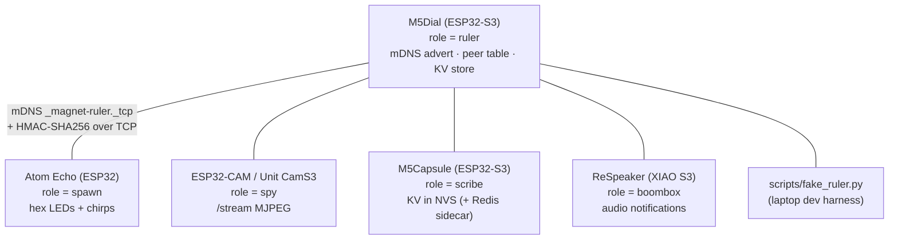
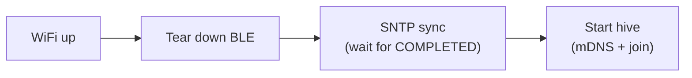

A MagNET hive is a **star** at the protocol level: one ruler, many nodes, each node talking to one ruler at a time. The richness comes from what flows over those links — authenticated joins, role grants, and shared-memory queries.

## Topology at the current checkpoint

A node discovers the ruler via mDNS, opens a TCP connection, and authenticates with a shared-secret HMAC. The ruler keeps a small table of live peers and serves a hive-wide key-value store. The same `fake_ruler.py` laptop script can stand in for either side, which makes the text-based wire format easy to debug with `nc`, Wireshark, or Python. See the full [Hive Protocol](/docs/hive-ai/hive-protocol/).

## The shared component stack

Every firmware project is assembled from the same reusable ESP-IDF components under `components/`. Adding a new node type is mostly a matter of symlinking these and mirroring the bring-up sequence.

| Component | Purpose |
|---|---|
| `craw_serial` | USB-serial-JTAG / UART0 console abstraction |
| `craw_nvs` | WiFi profile + credential persistence |
| `craw_wifi` | WiFi STA lifecycle with event callback |
| `craw_ble_provision` | BLE GATT service for WiFi provisioning + advertising/teardown control |
| `craw_hive` | The hive protocol — mDNS + TCP + HMAC-SHA256, **node and ruler sides in one component** |
| `craw_camera` | OV2640 wrapper, multi-board pin maps, NVS-persisted sensor settings |
| `craw_role_bundle` | Parse + verify-signature + CRC + base64-decode + `forth_eval()` install + NVS persist of role bundles |
| `craw_mdns` | Simple mDNS hostname publisher (pre-hive, retained for other projects) |
| `craw_imu` | BMI270 6-DoF IMU with Madgwick fusion (Capsule Redis variant) |
| `craw_audio` | I2S software-synth audio engine (Boombox) |

The `craw_hive` component exposes a clean split between the two sides:

- **Ruler:** `craw_hive_ruler_start()`, peer/KV/role-grant management, lineage-gate toggle.
- **Node:** `craw_hive_node_start()`, a small state machine, KV get/put, role-grant callback.

## The post-WiFi bring-up order is load-bearing

The sequence a node runs *after* WiFi comes up is not arbitrary — getting it wrong fails in non-obvious ways:



On the ruler side, one more rule: the listener **must spawn a per-client task on accept**. Handling a client inline blocks the listener for the entire session and locks out every subsequent peer.

## Phase history

The hive firmware didn't start as a hive — it grew through deliberate phases:

| Phase | What it produced |
|---|---|
| **0** | **EspJanet** — first known port of the Janet Lisp to ESP32 (research; shelved for small targets) |
| **2** | **ESPIDFORTH** — a self-contained Forth interpreter packaged as an ESP-IDF component |
| **2.5 / 3** | Forth-driven LED and display demos; the M5Dial playground reimplemented atop ESPIDFORTH |
| **4A** | **Milestone A** — reusable BLE WiFi provisioning |
| **4B** | **Milestone B** — ruler discovery + HMAC join (multi-node validated) |
| **4C** | **Milestone C** — signed Forth role bundles (steps 1–4 done) |

The choice of Forth is what makes runtime role swaps practical: a role is just a short Forth program small enough to fit in a single shared-memory value, delivered and executed on the fly. See [Controlling the Hive from Forth](/docs/hive-ai/forth-words/) and [Signed Role Bundles](/docs/hive-ai/role-bundles/).
