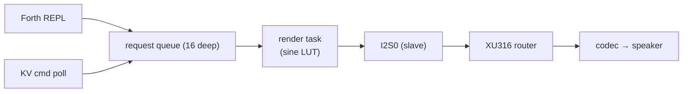

The **Boombox** (Role 12) is the hive's voice — *"any speaker or audio playback device; unlike the beeper, it can play full sounds, music, or recordings."* It runs on a XIAO ESP32-S3 socketed onto a Seeed ReSpeaker Lite Voice Kit, and synthesizes everything in software — no PCM files.

## Audio architecture

- **16 kHz / 16-bit synth → 32-bit stereo I2S** at slave-mode frame rate. The ESP32-S3 is the I2S **slave**; the on-carrier XMOS XU316 generates BCLK/WS and routes audio to the TLV320AIC3204 codec and speaker.
- **Software synth** — a 256-entry sine LUT with linear interpolation and Q16.16 phase accumulation.
- **Render task** drains a FreeRTOS queue of play requests; each request is up to 32 **segments**. Segment kinds: `TONE`, `SWEEP`, `AM`, `SLEEP`. Each can carry a **gain envelope** (`gain → gain_end`) for click-free attack/release.
- **No PCM on disk** — patterns are static arrays in flash. Adding a notification is one new array; bundle authors get the same primitives with no C at all.





## Primitives

These are the building blocks; the canned recipes and any bundle-authored sound compose from them.

### `tone` `( freq dur -- )`

Steady sine at `freq` Hz for `dur` ms. Returns immediately (enqueued, played asynchronously).

```forth
1500 200 tone     \ short beep at 1.5 kHz
262  500 tone     \ middle C for half a second
```

Frequencies below 4 kHz are safe at the 16 kHz sample rate; above that they alias.

### `sweep` `( f0 f1 dur -- )`

Linear frequency sweep from `f0` to `f1` over `dur` ms. Direction is implied by order.

```forth
400  1600 600 sweep    \ rising chirp (alert-style)
1600 400  600 sweep    \ falling chirp (error-style)
```

Interpolation is linear in time, not pitch — for an even-feeling wide sweep, chain shorter ones.

### `am` `( fc fm dur -- )`

A `fc` Hz carrier amplitude-modulated by an `fm` Hz sine, for `dur` ms — the basis of siren/wobble effects.

```forth
1000 4  800 am   \ 1 kHz wobbling 4×/s (the 'warn' sound)
2000 12 500 am   \ faster, angrier
```

Practical `fm` is 1–20 Hz; above ~30 Hz you enter ring-modulation territory.

### `sleep` `( ms -- )`

Inserts a silence segment — a spacer inside multi-segment compositions.

```forth
800 60 tone 100 sleep 800 60 tone     \ two-beep spacing
```

## Canned recipes

Each is a single fire-and-forget Forth word.

| Word | Sounds like | Duration |
|---|---|---|
| `alert` | Three rising chirps 600 → 1200 Hz | ~1.0 s |
| `notify` | Two-beep "ding-ding" at 1500 Hz | ~360 ms |
| `warn` | 1 kHz tone amplitude-modulated at 4 Hz | ~840 ms |
| `error` | Descending sweep 800 → 350 Hz + hold | ~600 ms |
| `siren` | Two-cycle wail 500 ↔ 1500 Hz | ~2.4 s |
| `yelp` | Fast wail — three 200 ms cycles | ~1.2 s |
| `nee-naw` | European two-tone, 950/750 Hz | ~2.4 s |
| `air-raid` | Slow ominous 300 → 800 Hz rise / hold / fall | ~3.8 s |
| `sunrise` | Ascending C-major arpeggio with crescendo | ~1.4 s |

`sunrise` plays once at boot when audio is up; the rest play on demand.

### Choosing a siren

- **`siren`** — generic emergency wail; the default if you just need "siren-y."
- **`yelp`** — fast and urgent; "attention right now" without the full `siren` wait.
- **`nee-naw`** — distinctly European "fire engine / police"; unmistakable dispatch character.
- **`air-raid`** — the longest and most ominous (rise + hold + fall). Reserve for big events; it occupies the speaker for nearly four seconds and there's no overlap mixing.

`warn` is the odd one out — an *alarm beep* (fast amplitude pulsing at fixed pitch), not a wail. Pair `warn` with brief events; pair the siren family with sustained ones.

## Volume & amp control

| Word | Effect |
|---|---|
| `vol` `( n -- )` | Master volume 0–100, persisted in NVS |
| `vol?` `( -- n )` | Push + print current volume |
| `audio-on` / `audio-off` | Enable/disable the amp gate (no-op on the Lite Voice Kit; reserved for carriers with a mute pin) |
| `audio-stop` | Abort the current segment and drain the queue; silence within ~32 ms |
| `audio-status` | Print amp / volume / rendering / queue / lifetime segment + sample counts |

`audio-status`' lifetime `samples` counter is the key troubleshooting signal: if a sound is silent but `samples` climbs, the synth is fine and the problem is downstream (carrier/codec).

## Remote triggering — `boombox:cmd`

Every 2 s while joined, the Boombox does `KV_GET boombox:cmd`. A non-empty value is `forth_eval`'d, then the key is cleared — so **any peer can trigger any sound** through the existing shared-memory protocol, no pub/sub needed:

```forth
s" alert" s" boombox:cmd" kv-set            \ play alert
s" 1500 100 tone" s" boombox:cmd" kv-set    \ freeform Forth
```

Because the phrase runs in the Boombox's Forth context, bundle-installed words (like `sos` or `fanfare` below) are reachable too. It's fire-and-forget — if two peers race within the 2 s window, only one wins (a per-node command key is planned for multi-boombox setups).

## Cookbook

Sounds that don't ship in firmware but drop straight into a [role bundle](/docs/hive-ai/role-bundles/):

```forth
\ SOS in Morse
: dot   800 60  tone  60 sleep ;
: dash  800 180 tone  60 sleep ;
: sos   dot dot dot  100 sleep  dash dash dash  100 sleep  dot dot dot ;

\ Doorbell chime
: ding  784 200 tone ;        \ G5
: dong  587 350 tone ;        \ D5
: chime ding 100 sleep dong ;
```

After install, these become permanent words that survive reboots via bundle NVS persistence.


