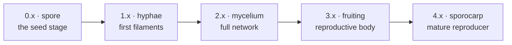
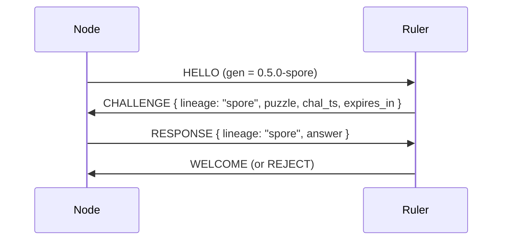

How does a hive decide whether a newcomer is *one of us*? The answer combines a versioning scheme (which firmware family a node belongs to) with a cryptographic membership test (proving it descends from that family). This page covers both — Layer 1 (observational versioning) and Layer 2 (the lineage puzzle gate).

## Why three version axes

A biologic carries three orthogonal version concepts. Keeping them separate avoids grief whenever any one moves:

| Axis | Lives in | Bumps when | Visible as |
|---|---|---|---|
| `proto` | `CRAW_HIVE_PROTO_VERSION` | message schemas change | mDNS TXT `ver=1` |
| `gen` | `include/magnet_gen.h` | firmware capabilities / NVS schemas evolve | HELLO/WELCOME `gen` |
| `role` | `craw_role_bundle` NVS slot | a node accepts a new `ROLE_GRANT` | HELLO `role_requested` |

## Generation tag (Layer 1)

Defined once in `include/magnet_gen.h` and embedded by every project:

```
MAGNET_GEN_STR = "<MAJOR>.<MINOR>.<PATCH>-<lineage>"
```

The current tree is `0.5.0-spore`.

**Bump rules:**

- **PATCH** — bug fixes, no observable change.
- **MINOR** — new optional features, caps, Forth words, bundle abilities. Stays backward compatible.
- **MAJOR** — incompatible NVS schemas, removed words, required new caps — *or a new mycology lineage*. A MAJOR bump always changes the lineage codename and adds a row to the lineage key table.

PATCH and MINOR bumps are backward compatible across the matching MAJOR. A MAJOR bump is the moment the hive's tribe instinct may say *"you are not one of us."*

### Mycology lineages

Each MAJOR family is codenamed after a stage of the mycelial life cycle. Old lineages stay valid forever — a `1.x-hyphae` ruler still recognizes a `0.9-spore` node, it just routes the join through the older puzzle key.



Adding a codename is a deliberate decision tied to a MAJOR bump, not a rename.

### What Layer 1 does and doesn't do

The `gen` tag is carried in HELLO and echoed in WELCOME; the ruler stores each joiner's gen for inspection (`ruler-status` shows a gen column). In v1 this is **observational only** — the ruler does *not* reject a peer on gen mismatch. Enforcement is Layer 2.

## The lineage puzzle gate (Layer 2)

> "It's up to the hive tribe to decide if a node can join. Sort of a 'you are not one of us' if it is too old or orthogonally related. Every join requires some puzzle to be solved, the solution only known in the DNA of the biologic. You keep old solutions."

Each MAJOR lineage carries a 32-byte **DNA key** baked into firmware. During join the ruler issues a `CHALLENGE`, and the joiner must answer using the key for *some* lineage the ruler still recognizes. A node that knows none of the ruler's kept keys is — by construction — not one of us.



### The extra round-trip



If the ruler doesn't require lineage verification (dev mode, or `gen` absent from HELLO), it skips CHALLENGE and proceeds straight to WELCOME — fully backward compatible.

### The puzzle math

The answer is an HMAC keyed by the lineage's DNA key, over the ruler's nonce, the node's id, and the challenge timestamp:

```
answer = HMAC-SHA256(dna_key[lineage], puzzle || node_id || chal_ts)
```

The ruler verifies in constant time:

```c
expected = HMAC-SHA256(dna_key[lineage], puzzle || node_id || chal_ts);
if (constant_time_eq(expected, answer)) WELCOME(); else REJECT("lineage_auth");
```



**Why HMAC over the puzzle, not just a static key?** A static key proves "I hold the value," not "I am freshly responding." Mixing the ruler's nonce, the node's id, and a timestamp makes a captured RESPONSE useless on a different connection.

### Where the keys live

`components/craw_hive/magnet_lineages.c` — one file, hand-edited at each MAJOR bump:

```c
const magnet_lineage_t MAGNET_LINEAGES[] = {
    { "spore",    { 0xA0, 0x8F, 0x19, /* ... 32 bytes ... */ } },
    { "hyphae",   { /* added when MAJOR -> 1 */ } },
    { "mycelium", { /* added when MAJOR -> 2 */ } },
    { NULL, {0} }
};
```



### Compatibility matrix

|  | ruler 0.x-spore | ruler 1.x-hyphae | ruler 2.x-mycelium |
|---|---|---|---|
| node 0.x-spore | ✅ direct | ✅ via spore key | ✅ via spore key |
| node 1.x-hyphae | ❌ ruler doesn't know hyphae | ✅ direct | ✅ via hyphae key |
| node 2.x-mycelium | ❌ | ❌ | ✅ direct |

Forward compatibility is **asymmetric on purpose**: a newer ruler accepts older nodes (it carries their keys), but an older ruler can't accept a future-lineage node. **To onboard a new MAJOR, flash the rulers first.**

## Migration playbook — bumping MAJOR

1. Bump `MAGNET_GEN_MAJOR` in `include/magnet_gen.h`; the codename auto-flips.
2. Generate a fresh 32-byte DNA key:
   ```bash
   python -c 'import secrets; print(", ".join(f"0x{b:02X}" for b in secrets.token_bytes(32)))'
   ```
3. **Append** the new `(codename, key)` row to `MAGNET_LINEAGES[]`. Never delete or reorder existing rows — old biologics are still valid members.
4. Update the compatibility matrix in this doc.
5. Bump `DEFAULT_RULER_GEN` in `scripts/fake_ruler.py`.
6. Flash rulers first, then nodes.
7. Optionally, once all rulers are upgraded, add a `gen_floor` policy to evict pre-MAJOR nodes.

## Implementation status


