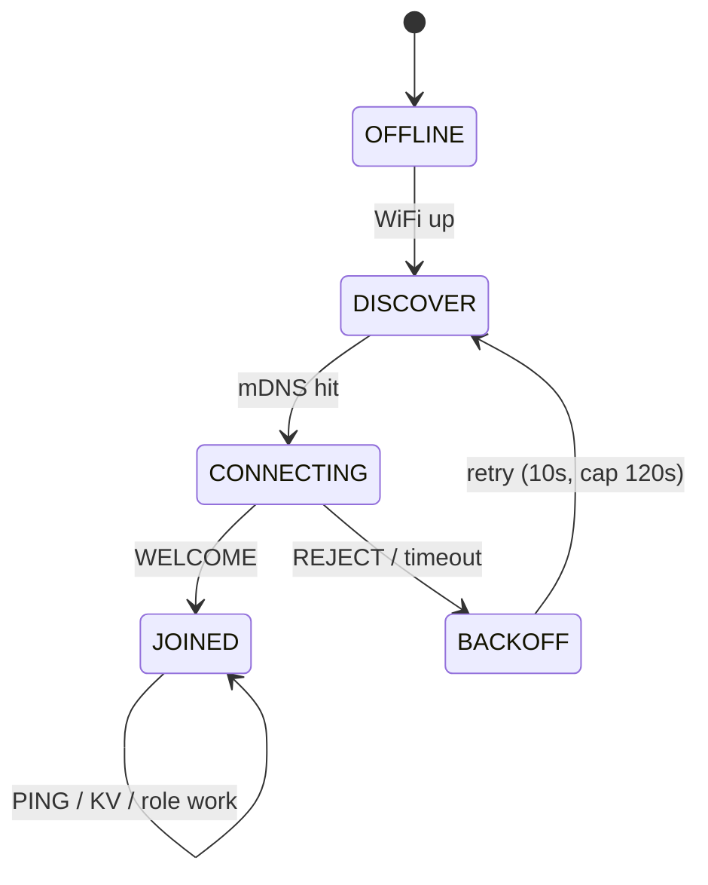

The hive protocol is the wire language nodes and rulers speak. It is deliberately **text-based and inspectable** — you can play either side with `nc`, a Python script, or Wireshark. This page is the implementer-facing reference; both sides live in the `craw_hive` component.

## Goals and non-goals

**Goals**

- A node that already has WiFi can find a ruler on the same LAN with zero configuration.
- A join is authenticated by a pre-shared secret — a stolen MAC alone cannot impersonate a node.
- The wire format is readable, so any tool can participate for debugging.

**Non-goals (v1)**

- Forward secrecy / key rotation (v2).
- Multi-ruler consensus — the ruler auto-accepts any valid HMAC.
- WAN / cross-subnet operation — mDNS + TCP means LAN only.
- Byzantine tolerance — holders of the shared secret are trusted.

## Discovery — mDNS

The ruler advertises:

```
_magnet-ruler._tcp.local   port 7447   TXT: ver=1, hive=<hive_id>
```

Port `7447` sits above the ephemeral range and spells "hive" on a phone keypad; it's configurable, and nodes read both host and port from the SRV record, so changing it is transparent.

TXT fields:

- `ver=1` — protocol version. A node **must** ignore a service advertising a higher `ver` than it speaks.
- `hive=<hive_id>` — 16-char hive slug. A node configured for `beehive-1` ignores a ruler advertising `lab-test`, so multiple hives coexist on one LAN.

A node scans up to 3 s, picks the first matching `(ver, hive)` service, resolves its A record, and — on miss — retries on a 10 s backoff (capped at 120 s).

## Transport — length-prefixed JSON over TCP

After TCP connect, each frame is:

```
[4-byte big-endian uint32 length N] [N bytes of UTF-8 JSON]
```

Max `N` is 4096 bytes in v1. There is no TLS by design: the HMAC authenticates the sender, and payloads are meant to be readable on the wire. Role bundles carry their own signature, so wire-level confidentiality and authenticity are separate concerns.

## Authentication — HMAC-SHA256

Every message, both directions, carries an `auth` field — HMAC-SHA256 over a canonical serialization of the other fields:

```
hmac = HMAC-SHA256(shared_secret, "<type>|<nonce>|<ts>|<payload-json>")
```

- `shared_secret` — 32-byte key, provisioned over BLE or hardcoded for bring-up (`CRAW_HIVE_DEV_SECRET`).
- `nonce` — 16 random bytes, hex-encoded. The receiver rejects a `(nonce, sender_id)` pair seen in the last 60 s (replay protection).
- `ts` — unix seconds, must be within ±30 s of the receiver's clock. Nodes SNTP-sync on WiFi join.
- `payload-json` — canonical: keys sorted, no whitespace.

On verification failure the receiver sends `REJECT { reason: "auth" }` and closes the connection.

## Message envelope

All messages share:

```json
{
  "type":    "<msg type>",
  "from":    "<sender id>",
  "to":      "<receiver id or *>",
  "nonce":   "<hex>",
  "ts":      1716950400,
  "payload": { },
  "auth":    "<hex>"
}
```

Sender ids are `MagNET-biologic-<MAC4>` (nodes) and `MagNET-ruler-<MAC4>` (rulers), derived from the WiFi MAC so they're stable across reboots.

## Message types

These map 1:1 to the `craw_hive_msg_type_t` enum in `craw_hive.h`:

| # | Type | Direction | Purpose |
|---|------|-----------|---------|
| 1 | `HELLO` | node → ruler | Request to join; advertises role, chip, caps, gen |
| 2 | `WELCOME` | ruler → node | Accept; assigns session id, role, heartbeat |
| 3 | `REJECT` | either | Refuse, with a reason |
| 4 | `PING` | either | Keep-alive (empty payload) |
| 5 | `ROLE_REQUEST` | node → ruler | Explicit re-role request |
| 6 | `ROLE_GRANT` | ruler → node | Assign a role + optional bundle reference |
| 7 | `KV_GET` | node → ruler | Read a shared-memory key |
| 8 | `KV_DATA` | ruler → node | Value on cache hit |
| 9 | `KV_PUT` | node → ruler | Write a shared-memory key (fire-and-forget) |
| 10 | `KV_NOT_FOUND` | ruler → node | Cache miss |
| 11 | `CHALLENGE` | ruler → node | Lineage puzzle (optional gate) |
| 12 | `RESPONSE` | node → ruler | Lineage puzzle answer |

### HELLO (node → ruler)

```json
"payload": {
  "role_requested": "spawn",
  "chip":           "ESP32-C3",
  "fw":             "0.1.0",
  "gen":            "0.5.0-spore",
  "hive":           "beehive-1",
  "caps":           ["led", "button"]
}
```

`caps` are free-form capability tags (`led`, `display`, `speaker`, `imu`, `temp`, …) the ruler can match against hive needs. The protocol never knows what a thermometer *is* — it only routes bundles and messages based on caps. `gen` is optional; older firmware may omit it.

### WELCOME (ruler → node)

```json
"payload": {
  "session_id": "<uuid>",
  "role":       "spawn",
  "heartbeat":  30,
  "gen":        "0.5.0-spore"
}
```

The node must send a `PING` at least every `heartbeat` seconds or the ruler evicts it (entries older than `3 × heartbeat` are pruned).

### REJECT

```json
"payload": { "reason": "auth" }
```

Reasons map to `craw_hive_reject_reason_t`:

| Reason | Meaning |
|---|---|
| `auth` | HMAC verification failed |
| `hive_mismatch` | Wrong hive id |
| `full` | Peer table at capacity |
| `ts_skew` | Timestamp outside the ±30 s window |
| `replay` | Nonce reused |
| `lineage_unknown` | Joiner lacks the requested lineage key |
| `lineage_auth` | Lineage RESPONSE HMAC didn't verify |
| `gen_too_old` | Gen below the ruler's policy floor |

The last three come from the optional [lineage gate](/docs/hive-ai/generations-lineage/).

### CHALLENGE / RESPONSE (lineage gate)

Inserted between HELLO and WELCOME *only* when the ruler enables the lineage gate — otherwise skipped, transparent to old nodes. The puzzle and its math are documented in [Generations & the Lineage Gate](/docs/hive-ai/generations-lineage/).

### ROLE_GRANT and the KV layer

`ROLE_GRANT` assigns a role and (from v1.1) references a bundle stored as a shared-memory value. The `KV_GET` / `KV_DATA` / `KV_PUT` / `KV_NOT_FOUND` messages are the generic shared-memory transport that role grants resolve through. Keys ≤ 32 bytes, values ≤ 3072 bytes (a single frame). See [Role Bundles](/docs/hive-ai/role-bundles/) for how a grant turns into installed behavior.

## Node session state machine



## Threat model (v1)

| Attacker | Mitigation |
|---|---|
| LAN device sniffing traffic | Payloads readable by design; no secrets on the wire |
| Device impersonating a node | No shared secret → HMAC fails → REJECT |
| Replay of a captured HELLO | Nonce + timestamp window |
| Ruler impersonation | Ruler responses also carry HMAC; a fake ruler can't forge WELCOME |
| Node with a leaked secret | Out of scope; rotation is a v2 feature |
| Flood of HELLOs | Ruler rate-limits per source IP (10 HELLOs/min/IP) |

## Implementation notes

- **HMAC** via mbedTLS (`mbedtls_md_hmac`).
- **mDNS** via the `espressif/mdns` managed component.
- **JSON** via cJSON.
- **TCP** via lwIP BSD sockets directly — small surface, no HTTP server dependency.
- **Shared-secret distribution:** compile-time `CRAW_HIVE_DEV_SECRET` for bring-up; provisioned over BLE in production.
