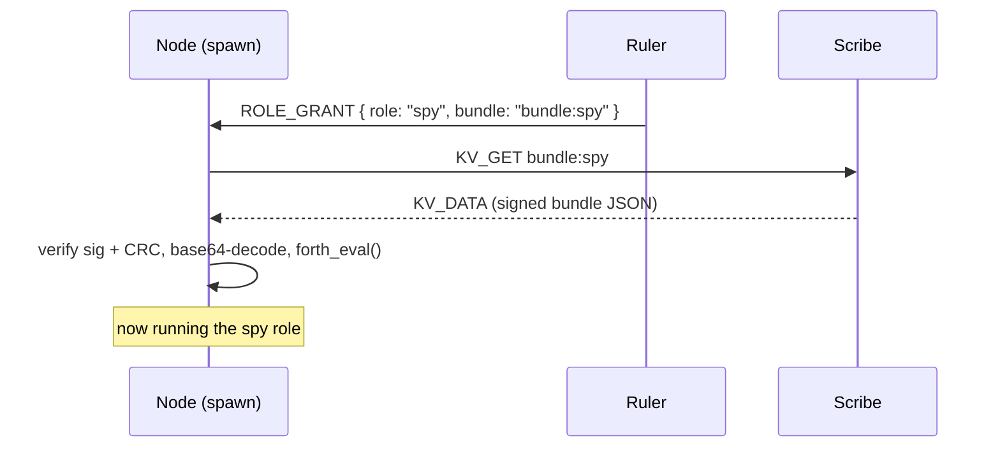

A **role** is the runtime function a node performs. Roles model the division of labor in a colony — most are general behaviors that any capable node can take on, a few are tied to specific hardware. A node starts as a `spawn` and can be promoted to another role at runtime via a [`ROLE_GRANT`](/docs/hive-ai/hive-protocol/#role_grant-ruler--node), which delivers the role's behavior as a [signed Forth bundle](/docs/hive-ai/role-bundles/).

## The roster

| # | Role | Function | Intended sprite | Status today |
|---|------|----------|-----------------|--------------|
| 1 | **Ruler** | Coordinates the hive; accepts joins; holds the peer table and shared memory. If no ruler is found, any node may request nomination. | Fiddler crab with a crown | ✅ Firmware (M5Dial) |
| 2 | **Worker** | Receives commands from the ruler and carries out tasks. | Robot with a pickaxe | ⏳ Bundle (planned) |
| 3 | **Parrot** | Only echoes commands it receives. | Robot parrot | ⏳ Bundle (planned) |
| 4 | **Scribe** | Saves data to internal memory and recalls it from shared memory on request. | Scholar with a stone tablet | ✅ Firmware (M5Capsule) |
| 5 | **Beeper** | Lights up or makes a noise on request. | 1980s pager | ⏳ Bundle (planned) |
| 6 | **Warrior** | Attacks unwanted entities that try to invade the network; the ruler directs its attacks. | Robot with a spear | ⏳ Bundle (planned) |
| 7 | **Spy** | Listens to all activity and notifies the ruler of new nodes. | Cute eyes | ✅ Firmware (Hive Camera) |
| 8 | **Pet** | A cute companion belonging to the ruler; barks at strangers. | Cute pet | ⏳ Bundle (planned) |
| 9 | **ML PhD** | Designs modifications to roles and distributes them for review by the ruler and scribe, upgrading the hive over time. | A PhD | ⏳ Concept |
| 10 | **Spawn** | Any new member starts here — no responsibilities except to learn from the scribe and other roles before taking a role. | — | ✅ Default role |
| 11 | **Eye** | Anything that can see, capture, scan, or take a picture/video. | A pair of cute eyes | ✅ Firmware (Hive Camera) |
| 12 | **Boombox** | Any speaker or audio playback device. Unlike the Beeper, it plays full sounds, music, or recordings. | 80s boombox | ✅ Firmware (ReSpeaker) |



## Two ways a role lives

The architecture deliberately splits roles into two delivery mechanisms:

**As a signed bundle (the default).** Most roles are pure behavior — listen, echo, save, notify. These ship as [role bundles](/docs/hive-ai/role-bundles/): a small Forth program, signed and versioned, that the ruler or a Scribe hands to a node at runtime. No reflash needed. Authoring a new general role is mostly a matter of writing Forth.

**As dedicated firmware.** A few roles need a hardware driver compiled in. The **Eye/Spy** needs the camera stack; the **Boombox** needs the I2S audio engine. These live as their own PlatformIO projects (see [Devices](/docs/hive-ai/devices/)) but still join the hive through the same protocol and can still install supplementary bundles on top.

## How a promotion happens

The ruler embeds bundles as a bootstrap fallback, but the design intent is that **bundles live on the Scribe** — which collapses "download a role" (R8/R9) and "query shared memory" (R16/R17) into one mechanism: a bundle is just a shared-memory value keyed `bundle:<name>`. See [Signed Role Bundles](/docs/hive-ai/role-bundles/) for the envelope format and install pipeline.
